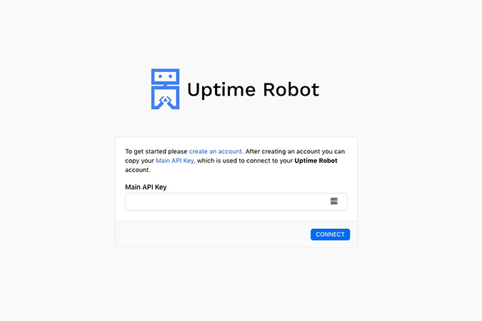
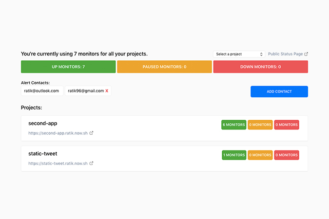
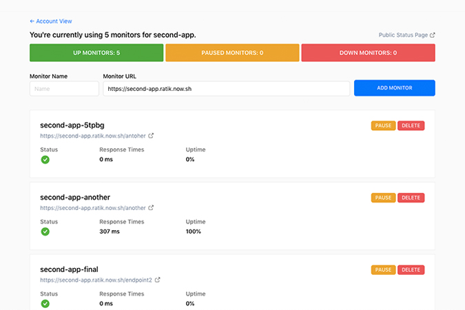
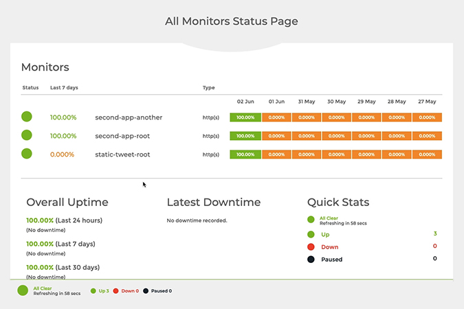

  
   
  <h1>Uptime Robot For Zeit</h1>
  <h4>Setup monitors for your apps straight from your Zeit dashboard. Get alerted when things don't work as expected.</h4>

 
## Features

- Provision monitors for all your projects and change their status.
- Monitor the response times and the overall uptime for your endpoints.
- Set up additional alert contacts and remove existing ones.
- Set up public status pages that you share with your users.

## How To Use

- Sign up on [UptimeRobot](https://uptimerobot.com/) and get an API key.
- Add the integration from the integrations marketplace. You can find it [here](https://zeit.co/integrations/uptime-robot).
- Once you add the key, you should see a list of projects and you can add monitors to any of them.
- We also made a video walking you through this whole process. You can find it [here](https://youtu.be/s86OHNi_sYM).

## Screenshots

  
  

  
  

## Contribute

In order to test the integration, you'll have to deploy your own version of it. You can find the instructions to do that [here](https://zeit.co/docs/integrations/#creating-an-integration).

- Fork the repo and clone your fork to your local machine.
- You should have the [now-cli](https://github.com/zeit/now-cli) installed to properly use this app.
- Run `yarn` to install the packages.
- You should now be able to run the integration using `now dev -p 5005`.

## Authors

- Faraz Patankar ([@farazpatankar13](https://twitter.com/farazpatankar13))
- Ratik Sharma ([@ratik96](https://twitter.com/ratik96))
